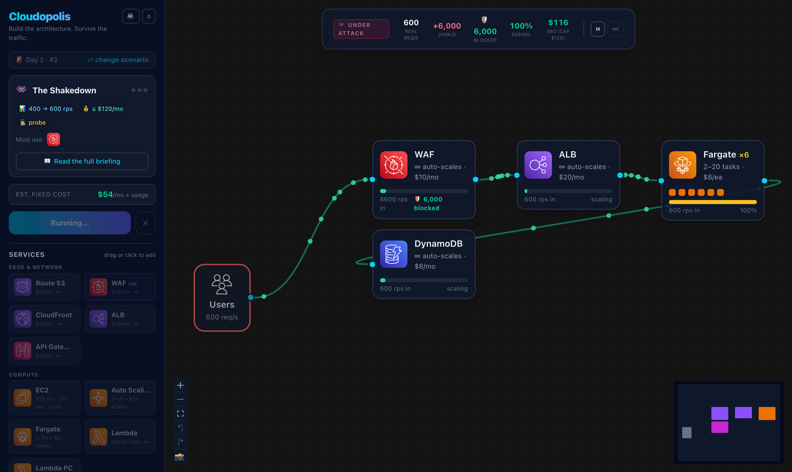
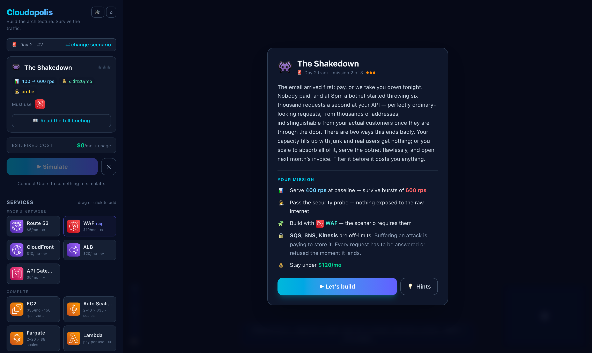
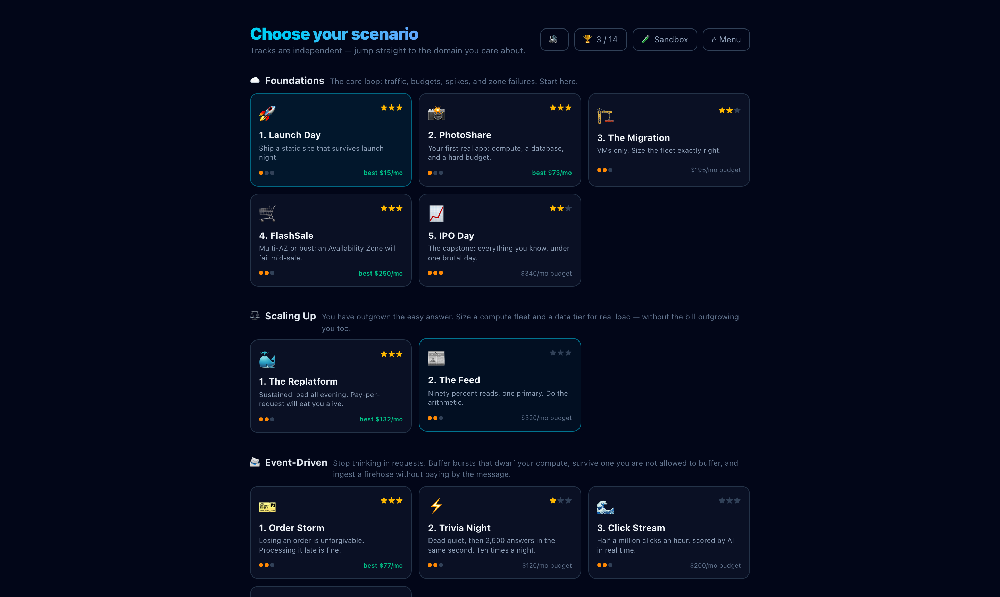
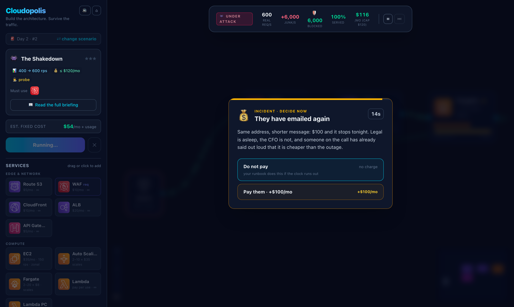
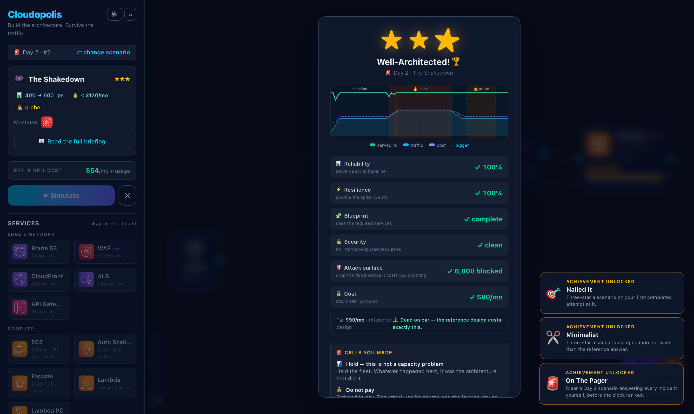

# Cloudopolis ☁️

**An interactive browser game for learning AWS architecture.**

Drag AWS services onto a canvas, wire them together, then hit **Simulate** — animated traffic
flows through your design, a spike tries to knock it over, an Availability Zone dies, a security
probe scans your edge — and you're scored on Well-Architected-style pillars.

It's a design tool with consequences: build it wrong and you *watch* it fall over.

**▶ Play it: <https://d7i4bs34j2edg.cloudfront.net>**

```
Users ──▶ CloudFront ──▶ S3          ★★★  $15/mo
Users ──▶ S3                         ★☆☆  saturated at 2,000 rps + public bucket flagged
```


*The Shakedown, mid-run: 6,000 junk requests a second dying at the WAF while real users get served.*

---

## Quick start

```bash
npm install
npm run dev
```

Open <http://localhost:5173>.

Tests, deployment, architecture notes, and everything else about working on the code
live in [docs/DEVELOPMENT.md](docs/DEVELOPMENT.md).

---

## How to play

1. **Pick a scenario** from the mission-select screen. A briefing opens the first time you enter
   one: the story, the traffic profile, the budget, and the explicit win conditions.
2. **Drag (or click) services** from the palette onto the canvas.
3. **Connect them** — drag from a node's right dot to another node's left dot. Traffic always
   starts at the **Users** node.
4. **Press ▶ Simulate.** Watch the baseline phase, then the spike, then whatever chaos the
   scenario has in store. Green dots are served requests; red means something is saturated.
5. **Earn three stars**: serve the baseline (≥98%), survive every event (≥95%), stay under budget —
   plus Blueprint and Security pillars where the scenario calls for them.

New here? The main menu has an **11-step guided tutorial** that walks you through Level 1 —
build it, fail the spike, get flagged by the security probe, fix both with a CDN, three stars.


*Every mission opens with a story and explicit win conditions — including the services it requires, and the ones it bans.*

---

## What's in it

### 5 tracks, 16 scenarios

Tracks are independent **categories**, not a difficulty ladder — pick whichever architecture
style you want to learn.

| Track | Scenarios | The lesson |
| --- | --- | --- |
| ☁️ **Foundations** | Launch Day · PhotoShare · The Migration · FlashSale · IPO Day | CDN caching, load balancing, managed data stores, Multi-AZ redundancy, auto scaling |
| ⚖️ **Scaling Up** | The Replatform · The Feed | You have outgrown the easy answer. Containers as the middle path — tasks scale twice as fast as VMs, bill in $8 slices, and beat pay-per-request outright at *sustained* load. Then a read/write split: 10% of traffic writes and must reach the one primary, 90% reads and fans out over fixed-size replicas you size for the peak and pay for at the trough |
| 📨 **Event-Driven** | Order Storm · Trivia Night · Click Stream · Paper Trail | A 12,000 rps burst a synchronous design *must* drop; API GW → SNS → SQS → Lambda buffers it and loses nothing. Then the mirror image: a burst you are *not allowed* to buffer, where the answer is a pre-warmed function instead of a queue. Then a firehose you must ingest without paying by the message — Kinesis's flat price against API Gateway's per-request bill. Then one stream with three destinations that each want a different slice of it — where a topic that broadcasts bills a consumer for every event on the platform to look at one in twenty |
| 🤖 **GenAI** | Prompt Rush · Grounded | Bedrock's quota and token costs beaten by a semantic cache; then RAG — every request must *retrieve then generate*, so the cache is what makes the quota survivable at all |
| 🚨 **Day 2** | Game Day · The Shakedown · The Blackout | The design is already shipped; now you are on call. Incidents interrupt the run and you answer them live, and every offer is answerable with money — which is the point, because emergency capacity is billed to the same budget you are scored against. Then a botnet, and the two ways a flood kills you: it eats the capacity your customers needed, or you absorb all of it and get invoiced per request for serving a botnet. Then the last exam: an entire Region goes dark and the app stays up |
| 🛠️ **My Scenarios** | *yours* | Author your own missions in the built-in scenario editor |


*Stars and personal-best costs live on the cards, so the map doubles as a progress board.*

### Simulation mechanics

- **Tick-based flow model** — traffic is routed through the graph every tick, with per-node
  capacity, overflow, and drop accounting.
- **Health-aware routing** — load balancers, compute, and caches route around dead nodes.
  The **Users** node does not: DNS is dumb, which is exactly why you need a load balancer.
- **AZ outage** — mid-run an entire Availability Zone dies. Everything zonal inside it goes with
  it. Real redundancy means one of everything zonal in *each* zone.
- **Region outage** — the multi-region finale zooms out a level: the canvas shows two **Region**
  boxes instead of AZs, every service except DNS and the CDN edge must live inside one, and the
  outage takes a whole Region with everything in it. The failover lesson falls straight out of
  the existing health model — routers health-check their targets and Users do not, so wiring
  Users to both Regions keeps walking half of every request into the dead one, while Route 53
  in front routes 100% to the survivor.
- **Security probe** — attackers scan for resources wired straight to Users. Public S3 buckets,
  exposed databases and caches, and naked compute all fail the Security pillar. Only CloudFront,
  ALB, and API Gateway belong on the internet edge.
- **Elastic fleets** — Auto Scaling groups (2–10 instances × 150 rps) and Fargate services
  (2–20 tasks × 100 rps) both step toward demand rather than arriving instantly, and the step
  *rate* is their personality: containers add 600 rps of capacity per tick, VMs 300. Sharp
  spikes hurt either way; they just hurt VMs for longer.
- **Read/write splits** — a scenario can declare a `writeFraction`, and the app tier then routes
  the two apart the way a reader endpoint does: writes go only to services that accept them,
  reads fan out over read replicas when any are wired. Replicas refuse writes and are useless
  without a primary to stream from, so the classic mistakes ("replicas instead of the primary",
  "one big primary for everything") each fail in their own way.
- **Cold starts** — in scenarios that ask for them, a serverless function only serves what it has
  warm. Warm capacity climbs quickly toward demand and drains away while idle, so a workload that
  is quiet between bursts goes cold again before every one of them. Provisioned concurrency buys a
  floor that never goes cold. Paired with **burst traffic**: a square wave that slams between peak
  and idle with no ramp, because a ramp gives a function all the time it needs to warm up.

*Day 2 levels page you mid-run. Every offer can be answered with money — billed to the same budget you are scored on.*

- **Mid-run decisions** — an incident can interrupt a run: the simulation freezes, a countdown starts,
  and two options wait. Answer, or the scenario's runbook default is applied for you. Effects stack and
  expire independently (emergency capacity bought at the top of a spike is still there when a leak
  starts eating into it), and surcharges land on the same bill the design is scored against. The
  options are written so the tempting one costs money and the free one only works if the design was
  already right — a decision punishes the architecture that needed it rather than handing out a
  power-up.
- **Rule-based routing vs. broadcast** — SNS hands every subscriber a full copy of every event.
  EventBridge delivers each target only the share its rule matched, from the scenario's `busRules`.
  Same picture on the canvas; on a consumer that cares about 5% of the stream, twenty times the
  difference in what it processes and what it bills. A rule wired at nothing still fires, and
  everything it matched is lost — so you cannot win by building fewer destinations.
- **Delivery streams** — a `deliversToStorage` queue (Firehose) drains into object storage as well
  as compute, with no function in the path, and what it delivers arrives *batched*: thousands of
  events a second land as a handful of writes, so the bucket never feels its 1,000-rps request
  ceiling. A function doing the same job does one PUT per event and pays it in full. An event bus
  wired straight at a bucket delivers nothing at all — there is no PutEvents target on S3, and that
  gap is the whole reason the delivery stream exists.
- **Attack traffic** — a scenario can declare an `attack`, a flat flood of junk requests arriving
  alongside the real ones during the spike. It is indistinguishable from real traffic once it is
  past the edge, so every capacity ceiling, cache hit ratio, and fan-out split applies to both in
  proportion — but `served` and `total` stay counted in *real* requests, so success keeps meaning
  what your users experienced. It bites twice: junk occupies capacity that customers needed, and
  junk that gets *processed* is billed at full per-request price. That second one is the whole of
  economic denial of service, and it means absorbing a flood is not surviving it. **AWS WAF** is
  the answer — a `scrubsAttack` service that drops the flood at the edge for a flat $10 — and
  *where* you put it decides whether it works, because a scrubber behind API Gateway blocks the
  attack only after the meter has already run.
- **Retrieve-then-generate chains** — a vector store (OpenSearch) is a *mid-chain* stage: it
  grounds a request and forwards all of it onward, answering nothing itself. A request counts
  as served only once it completes the whole chain, so RAG is visible on the canvas as
  `cache → retriever → model`.
- **Async pipelines** — SQS/Kinesis nodes hold a live backlog that drains at consumer capacity;
  SNS fans out a copy per subscriber. Async scenarios are scored on **Delivery / Durability /
  Drain** instead of instant service.
- **VPC, Availability Zone, and Region containers** — React Flow subflows with drag re-parenting.

### Sound

Short synthesized cues — a run starting, traffic spiking, a Region going dark, the botnet opening
up, the pager going off, and a different chord for three stars, a pass and a failure. Everything is
a handful of oscillator notes with an envelope: no audio files, no licences, nothing to download,
and blips suit a simulator better than stock foley. The master gain is deliberately low; 🔊 in the
sidebar or on the scenario screen mutes it, and that preference is written immediately rather than
waiting out the autosave throttle.

There are no `play()` calls in the store or the components. A single subscriber diffs consecutive
store states and asks one pure function, `cuesForTransition(prev, next)`, what to play — so the
trigger rules are unit-testable with no AudioContext, and every cue keys off a *transition* rather
than a state. That distinction is the whole feature: Trivia Night re-enters its spike phase ten
times a run and attack traffic changes on every tick, so playing on the state instead of the edge
would turn either into a machine gun.

### Undo / redo

⌘Z / Ctrl+Z and ⌘⇧Z / Ctrl+Y, or the ↶ ↷ buttons on the canvas controls. Adding a service,
deleting one, drawing an edge, moving a node, clearing the canvas and revealing the reference
answer are all one step each.

The work is in deciding what "one step" means. React Flow reports a drag as a stream of position
changes — one per frame — plus changes for pure-UI events like selection, so committing history on
every change would give you an undo stack that walks a node back across the canvas a pixel at a
time. History is therefore a list of **commits** rather than a change log: a drag records the
canvas on drag-*start* and commits it on drag-*stop*, and commits nothing at all if the node did
not actually move, since a plain click is a zero-distance drag and pressing undo afterwards should
not sit there doing nothing.

Undo is disabled during a run — rewriting the canvas underneath the tick loop would desync it —
and the history is dropped when you switch scenarios, so undo can never paste one level's design
onto another. It is deliberately not persisted: resuming into a stack of edits you do not remember
making is worse than having no history.

### Achievements

Fourteen badges, behind a `🏆` button on the scenario screen. Locked ones are shown with their
description rather than hidden — they are meant to read as things worth trying.

The rule every one of them passes: **it has to be possible to miss while still three-starring**, or
else be a collection milestone. A badge that fires on every three-star run is just a second star
rating in a different font, which is why there is none for "passed the security probe" or "did not
pay the ransom" — both are already required to three-star the levels they belong to.

- **Milestones** — one for your first three stars, one per track, one for a clean sweep. These are
  recomputed from your star record rather than latched, so they unlock retroactively.
- **Feats** — three-star on your first attempt (or, conversely, on a level that already beat you
  twice), come in 40% under budget, match the reference answer's service count, or clear a Day 2
  level answering every incident before the clock.
- **Two for doing rather than scoring** — export an image, and write a scenario of your own.

The whole rule set is one pure function in `src/game/achievements.ts`, so `achievements.test.ts`
exercises it without a store or a canvas — mostly with negative assertions, since "does not fire"
is the property that matters.

### Getting unstuck

Fail the same scenario twice and the results modal offers **📖 Reveal a 3-star answer**: it
replaces your canvas (after confirming) with a reference design, then explains in three lines
why that design works — what each piece absorbs, what it costs, and which wrong turn it avoids.
Run it straight away and watch every pillar go green.

The reference designs live as data in [`src/game/solutions.ts`](src/game/solutions.ts), and
`solutions.test.ts` replays **every one of them through the real engine, over the real phase
script, scored by the real star rules**, asserting three stars. A rebalance that leaves a
reference answer short of full marks fails the test gate before it can ship — so the game can
never hand out an answer that doesn't actually work.

### The scenario editor

The 🛠️ **My Scenarios** track has a full in-game editor: write the story, set the
traffic profile and budget, toggle events (probe / VPC / AZ outage), cycle any service
through *allowed → required → banned* with a reason, and add hints — with a live card
preview as you type. Authored scenarios run through the exact same engine, events, and
scoring as the built-ins.

Every custom scenario has a **share code** (📋 on its card): one paste-able string that
carries the whole mission. Anyone can import it from the editor — no backend, no account.
That makes Cloudopolis a workshop tool: author a mission that mirrors a team's real workload,
drop the code in chat, and everyone designs against it. Imports are sanitized (lengths
capped, numbers clamped, service ids validated) and always get a fresh id, so a code can
never overwrite or impersonate an existing scenario.

Custom scenarios live in `localStorage`, so the track header also has **⬇ export / ⬆ import**:
export downloads your whole library as one JSON file, and import merges a file back in,
skipping scenarios you already have — an idempotent backup/restore that survives cleared
browser data and moves libraries between machines.

### 🧪 Sandbox mode

A blank region with **no budget, no scoring, and no script**. Press ▶ and the simulation
runs *endlessly* while you drive it: a live traffic dial (10 → 20,000 rps with one-tap
presets), a static/app workload toggle, and chaos on demand — kill or revive either
Availability Zone mid-run, and fire the security probe whenever you want. A live hint
line diagnoses whatever is currently breaking.

That makes it the whiteboard-that-runs: sketch a customer's architecture in front of
them, then slide the traffic up until something gives.

First visit runs an **11-step guided tour** — it builds a load-balanced two-AZ design with
you, then walks through the controls that make the sandbox different: turn the traffic up
until the servers overload, bring it back down, kill a zone and watch the failover, and
fire the security probe. Replay it any time from the sandbox panel.

### Presenting and sharing

- **Presenter controls** in the run HUD: **⏸ pause** freezes the simulation mid-spike so you
  can point at the saturated database, and **⏭ step** walks it forward one tick at a time while
  you narrate. Pausing shifts the run's clock rather than stopping it, so resuming continues at
  the right pace instead of fast-forwarding through everything it missed.
- **📸 PNG export** on the canvas controls downloads the current architecture at any time.
- **📸 Share card** in the results modal composes that architecture under a header with the
  scenario, the stars earned, and the monthly cost — the thing to drop in Slack after a workshop.

### Quality of life

- **Interactive run timeline** in the results: a tick-by-tick chart of the run you just
  watched — phase bands (baseline / 🔥 spike / 💥 outage / 🕵️ probe) under served %, incoming
  traffic, queue backlog, and cost, so you see *exactly when* the design broke and when it
  recovered. Hover to scrub a crosshair and read real values at any moment; click for a
  full CloudWatch-style view with dual axes (served % left, rps right), a budget reference
  line, worst-served callout, and a legend that isolates any series.
- Progress persistence in `localStorage` — best stars per scenario, tutorial completion, and the
  canvas itself, so **Continue** survives a reload.
- Official **AWS Architecture Icons** in nodes and palette.
- Architect's Notes after every run: targeted diagnosis of what broke and why.
- **Par cost** — the results screen shows the reference design's bill next to yours, and
  every card keeps your cheapest three-star run. Matching par is the win; beating it is a flex.


*Three stars on The Shakedown: every pillar, the run timeline, par — and the achievements it just unlocked.*

---

## Backlog

Roughly in order:

- **Touch & tablet support** — bigger connection targets on coarse pointers, tap-tap to
  connect, a collapsible sidebar below tablet width. Phones stay out of scope: this game
  is a canvas problem, not a breakpoint problem.
- **Offline / PWA** — the site is fully static, so a service worker makes it installable
  and workable on conference wifi. The care point is cache invalidation vs. the CloudFront deploy.
- **Accessibility pass** — keyboard-only building (connecting is drag-only today), ARIA
  on canvas nodes, and honoring `prefers-reduced-motion`.
- **More scenarios** — the mechanics already exist (decisions, attacks, cold starts,
  multi-region, bus rules); new levels are data. A cost-anomaly incident and a
  compliance-probe variant are first in line.

---

## License

[MIT](LICENSE) © 2026 Reynold Nathaniel

## Notes

Costs and capacities are **simplified for gameplay** — directionally true, not a pricing
calculator. Don't size a real workload with this.

AWS service icons are the official AWS Architecture Icons, used under the
[AWS Architecture Icons terms](https://aws.amazon.com/architecture/icons/). AWS and the AWS
service names are trademarks of Amazon.com, Inc. or its affiliates. This project is not
affiliated with or endorsed by AWS.
